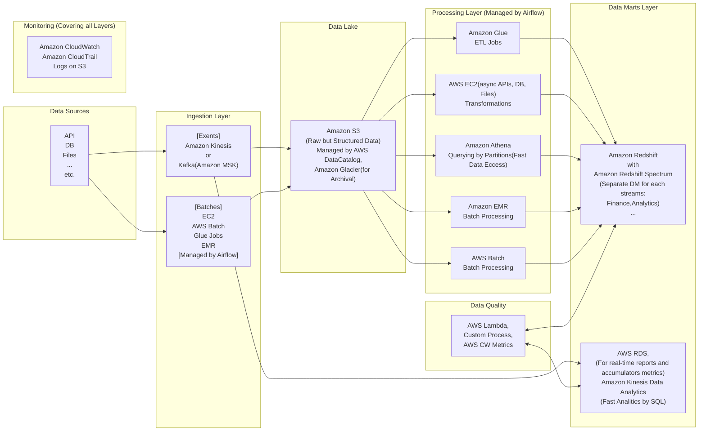

# Data Engineer Case Study

## Designing a robust data ecosystem
Designing a modern AWS cloud-based architecture for loading and processing huge volumes of structured, 
semi-structured, and unstructured data daily, with updates occurring every couple of hours and low latency requirements, 
involves a combination of services and components to ensure scalability, reliability, and performance. 
Here's an architecture that we could consider:


0. **Data Sources:**

This component represents the diverse sources of data that our architecture is designed to handle. 
These sources include structured, semi-structured, and unstructured data from various systems and applications.


1. **Data Ingestion:**

Facilitates real-time data ingestion through Amazon Kinesis or Kafka (Amazon MSK), ensuring swift and seamless data acquisition.

* Amazon Kinesis Data Streams: Use Kinesis to ingest real-time data streams from various sources, including structured, semi-structured, and unstructured data. 
Set up appropriate Kinesis delivery streams to handle the different types of data.
Directly load data into Amazon S3 buckets.
* Kafka: If you need a more robust and scalable solution for real-time data ingestion, you can use Kafka. Kafka can be deployed on fleet of EC2 instances or as a managed service using Amazon MSK (Managed Streaming for Kafka).
* Batches: Supports batch data ingestion via EC2, AWS Batch, Glue Jobs, EMR, and managed by Airflow, offering flexibility in data loading strategies.


2. **Data Lake:**

Amazon S3 (Simple Storage Service): Acts as the centralized data lake, storing raw but structured data. Managed by AWS DataCatalog for efficient organization and retrieval, with Amazon Glacier for archival.
* AWS Glue Data Catalog: Maintain metadata and schema information for your data. This helps with querying and understanding the data.
* Pay attention on Data Lineage approach (e.g. based on DataHub tool) to track the data flow and dependencies between the different layers.


3. **Data Processing:**

_`Will be orchestrated and managed by Airflow`_


Processing data in a data lake involves a combination of services and components, depending on the type of data and the processing requirements.

Will be main processing layer for building Data Marts.

* Amazon Glue or AWS Lambda: Glue can be used for ETL (Extract, Transform, Load) jobs, especially for structured data. Lambda functions can be used for lightweight processing and transformations.
* AWS EC2 (Elastic Compute Cloud): For processing tasks and transformations (e.g. async unloads from APIs, DBs).
* Amazon Athena: Query data directly on S3 using standard SQL queries. For fast data access.
* Amazon EMR (Elastic MapReduce): For more complex processing tasks, big data processing, and transformations with Spark(PySpark)
* Amazon Batch: For high-scale batch processing, especially for data that arrives less frequently but needs extensive processing.


4. **Data Marts Layer:**

* Amazon Redshift: Empowers specialized data marts with Amazon Redshift Spectrum, enabling tailored analysis for distinct streams such as Finance and Analytics.
* Amazon Kinesis Data Analytics (or from Kinesis/Kafka to AWS RDS): Supports real-time reporting, accumulator metrics, and high-speed analytics through SQL queries, enhancing the availability of insights.


5. **Data Orchestration:**

* Airflow: For orchestrating and scheduling data pipelines. Orchestrate and coordinate the different stages of your data pipeline. This can manage retries, parallel processing, and error handling.


6. **Monitoring and Logging (Wrapping all processes and layers):**

* Amazon CloudWatch: Monitor resources, set up alarms, and gain insights into system performance.
* Amazon CloudTrail: Log API calls and activities for auditing and troubleshooting.


7. **Data Quality:**

Custom Process (or using AWS Lambda), AWS CW Metrics: Ensures data quality by applying custom processes or AWS Lambda functions, with continuous monitoring through CloudWatch metrics.


8. **Security:**

* Amazon IAM: Control access to resources and services.
* Amazon VPC (Virtual Private Cloud): Isolate your resources within a private network.


9. **Backup and Disaster Recovery:**

* Amazon S3 Cross-Region Replication: Replicate data across regions for disaster recovery.
* Amazon Glacier: Archive infrequently accessed data for cost-effective storage.


10. **Infrastructure AS Code:**

* AWS CloudFormation or Terraform (preferred based on more flexible) for creating and managing your architecture in a repeatable and version-controlled manner.

### **Main points to consider:**

* Each provided level has to be wrapped custom (or based on CloudWatch) metrics and alarms to monitor the health and consistency data in the system.
For example on process level, we can monitor the number of processed records, the number of failed records, the number of records that are not processed within a certain time window, etc.
* At the beginning of the project, we can define Data Lineage approach (e.g. based on DataHub tool) to track the data flow and dependencies between the different components.


## Data warehousing
Incorporating the data warehouse into the existing architecture involves the following components and concepts:

**Data Warehouse Provider:**
* A dedicated data warehouse service to efficiently store, organize, and manage large volumes of structured data for analytics and reporting purposes.

**ELT Processes (Not ETL in our case):**
* Extract, Load, Transform (ELT) processes to move data from various sources into the data warehouse. Transform will be directly for Data Marts.
Data transformation may involve aggregating, cleaning, and joining data to ensure consistency and quality.

**Data Storage and Schema:**
* Storing data in a structured manner optimized for analytics and querying.
Defining appropriate data schemas, tables, and relationships to enable efficient querying and reporting.

**Indexing and Partitioning:**
* Implementing indexing and partitioning strategies to enhance query performance and reduce data scanning.

**Access Control and Security:**
* Enforcing strict access controls to ensure data security and privacy.
* Implementing encryption at rest and in transit.

**Querying and Reporting:**
* Providing tools and interfaces for users to perform ad-hoc querying, reporting, and data visualization.
* Enabling efficient execution of complex analytical queries.

**Scalability and Performance:**
* Designing the data warehouse to scale horizontally or vertically to handle growing data volumes and user demands.

**Solution Explanation:**
* The proposed data warehouse integrates seamlessly with the existing architecture to provide a central repository for structured data collected from various sources. This repository supports advanced analytics, reporting, and data-driven decision-making. Here's how each component fits:


### Data Warehouse Solution for aur case:

* Amazon Redshift is a suitable choice for the data warehouse. It is a fully managed, high-performance data warehousing service optimized for online analytical processing (OLAP) workloads.

**Data Storage and Schema:**
* Define data schemas in Redshift to represent different datasets, ensuring efficient storage and retrieval.

**Indexing and Partitioning:**
* Utilize Redshift's columnar storage and distribution styles for optimized query performance.
* Implement appropriate sort and distribution keys for frequently queried columns.

**Access Control and Security:**
* Configure IAM roles and policies to control access to Redshift resources and data.
* Implement data encryption using Redshift's encryption options.

**Querying and Reporting:**
* Enable users to connect to Redshift using SQL-based querying tools, such as Amazon QuickSight or third-party BI tools (like Looker).

**Scalability and Performance:**
* Redshift's automatic scaling and elastic resize features ensure performance as data volume and query complexity increase.
Component Justifications:

### **Main DWH points:**
* In our case better to use Data Marts approach for each department/requirements.
* So, S3 will be one cleaned and structured data source with partitioned data (based on S3) for all Data Marts based on Redshift.
* In some cases, data marts structure can be redundant but in our case, it helps to avoid frequent changes for one huge DWH. 

So, for each stream (like Finance, Analytics) we will build their own DM. And each DM (we can call it micro DWH) could be in a hybrid style: Mix of Inmon, Kimball, and DataVault models based on metrics and input data.
My prefer to use mix of Kimball and DataVault.

**Kimball Methodology:**
The Kimball approach is well-suited here because the company can create specific data marts focused on marketing and sales. 
These data marts would contain dimension tables (e.g., customer, product) and fact tables (e.g., sales transactions) in a star schema or snowflake schema. 
Business analysts and marketing teams can easily query and analyze the data, identifying trends and insights to optimize marketing campaigns and improve sales performance.

**Data Vault Methodology:**
The Data Vault focuses on flexibility, scalability, and agility in handling complex and rapidly changing data environments.
This approach would be advantageous scenario
where need to collect data from a wide range of sources, including social media, IoT devices, and third-party APIs. 
And need to quickly integrate and analyze this data to support innovation and product development.

**Conclusion:**

_Redshift_ Provides a high-performance, fully managed data warehouse with advanced optimization techniques.
Scales easily to accommodate large datasets and complex queries.
Offers integration with other AWS services and tools for analytics.

* Amazon Redshift is recommended as the data warehouse provider. 
* Its columnar storage, distribution styles, and optimizations for analytics align with the requirements of handling huge TBs of structured data for analysis. 
* Redshift's compatibility with AWS services, seamless data integration, and scalability make it a robust choice.
* The architecture ensures efficient data warehousing, accessibility, and analytical capabilities while remaining within the AWS ecosystem for seamless integration.
* In some cases we can use AWS RDS (PosrgreSQL) as a data mart provider. When we will have a lot and frequent changes. E.g. getting data directly from Real-time services and building nearly real-time reports


### **Main points to consider:**
**Cost Optimization:**
* Optimize costs by using a mix of storage classes, instance types, and reserved instances.
* Use AWS Cost Explorer and AWS Budgets to monitor and manage costs.

## API Integrations
Interacting with external APIs and embedding the data into data loading process.

The result of each API will be normalized and stored in S3 (in some cased can work through Kafka/Kinesis) (through Glue Data Catalog) and then needed data will be loaded into Redshift (for specific Data Mart).

### Crunchbase API
Crunchbase API is a RESTful API that enables developers to programmatically retrieve information from the Crunchbase system about companies, people, investments, and other related data.

Run tests:
```bash
 pytest tests/test_crunchbase.py
```

Run unloading data from Crunchbase API:
two modes are available:
* 'full' - searching needed organisation from all organisations in [Crunchbase](https://data.crunchbase.com/docs/using-search-apis)
* 'specific' - data unloading from [Crunchbase](https://data.crunchbase.com/docs/examples-entity-lookup-api) API for specific organisation. Permalink ot uuid we take from [api](https://data.crunchbase.com/docs/using-autocomplete-api)

first step (creating and activating venv): _can be made with bash script_
```bash
  cd crunchbase
  python3 -m venv test_crunchbase
  source test_crunchbase/bin/activate
  pip install -r requirements.txt  
```
then:
```bash
 python3 -m crunchbase --mode 'specific'
```
or
```bash
 python3 -m crunchbase --mode 'full'
```
